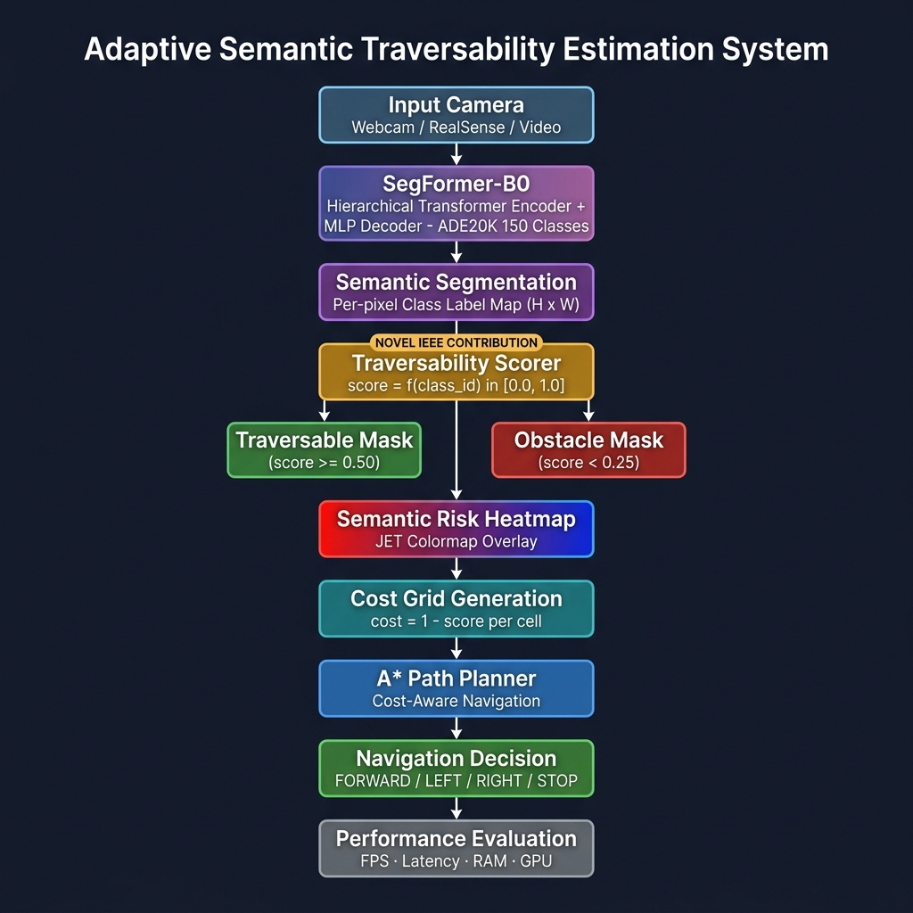
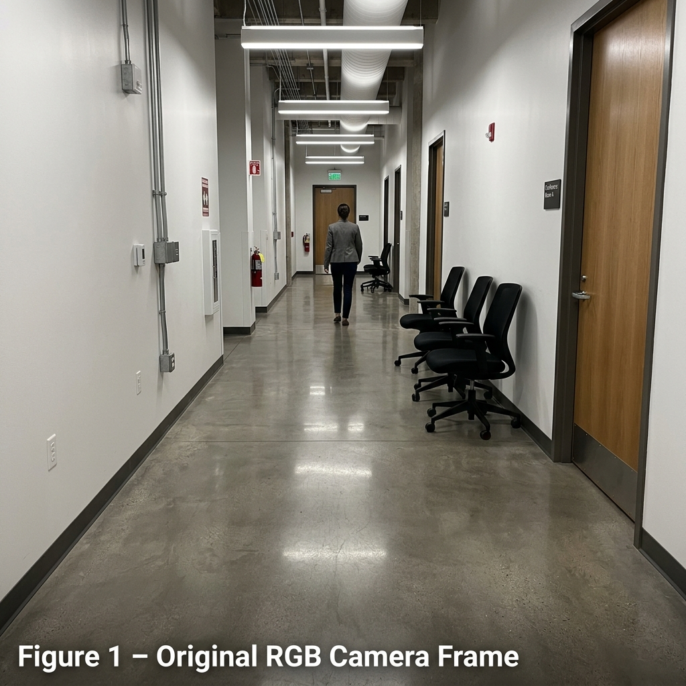
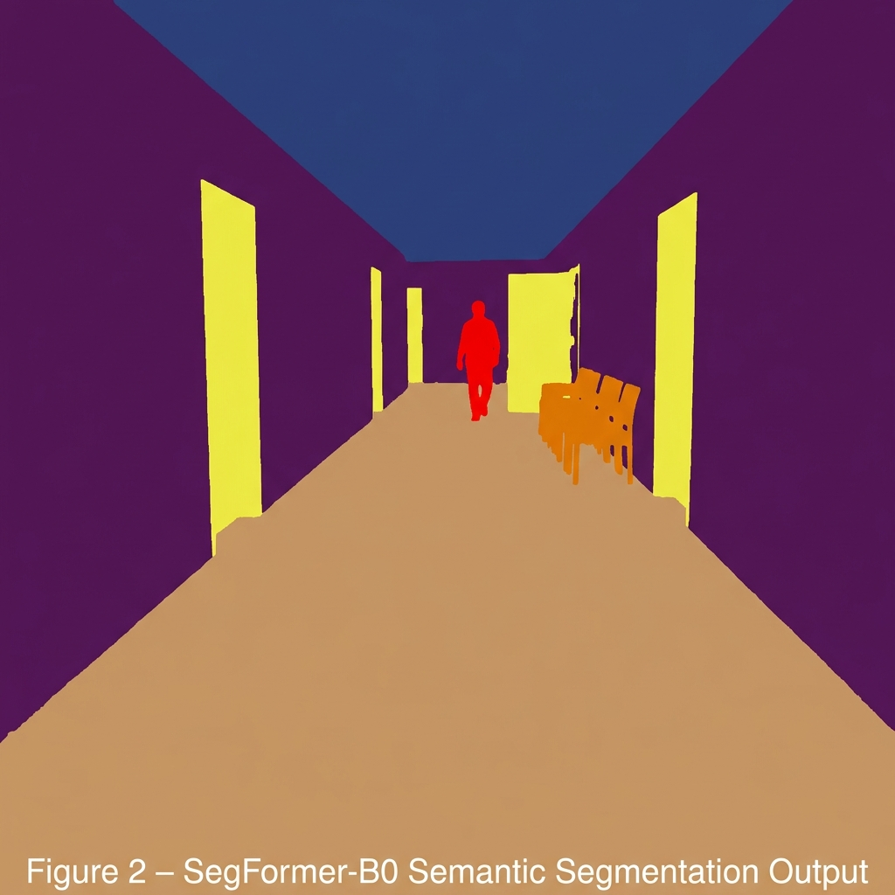
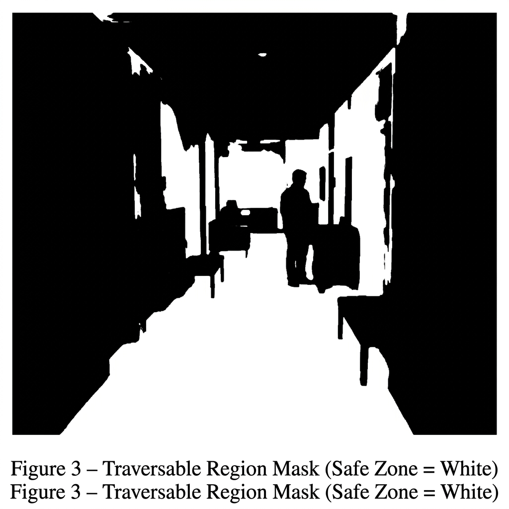
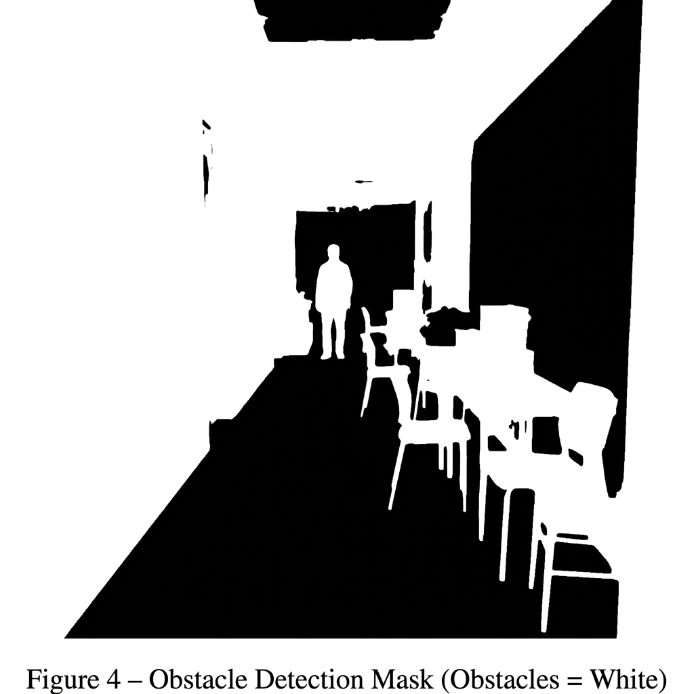
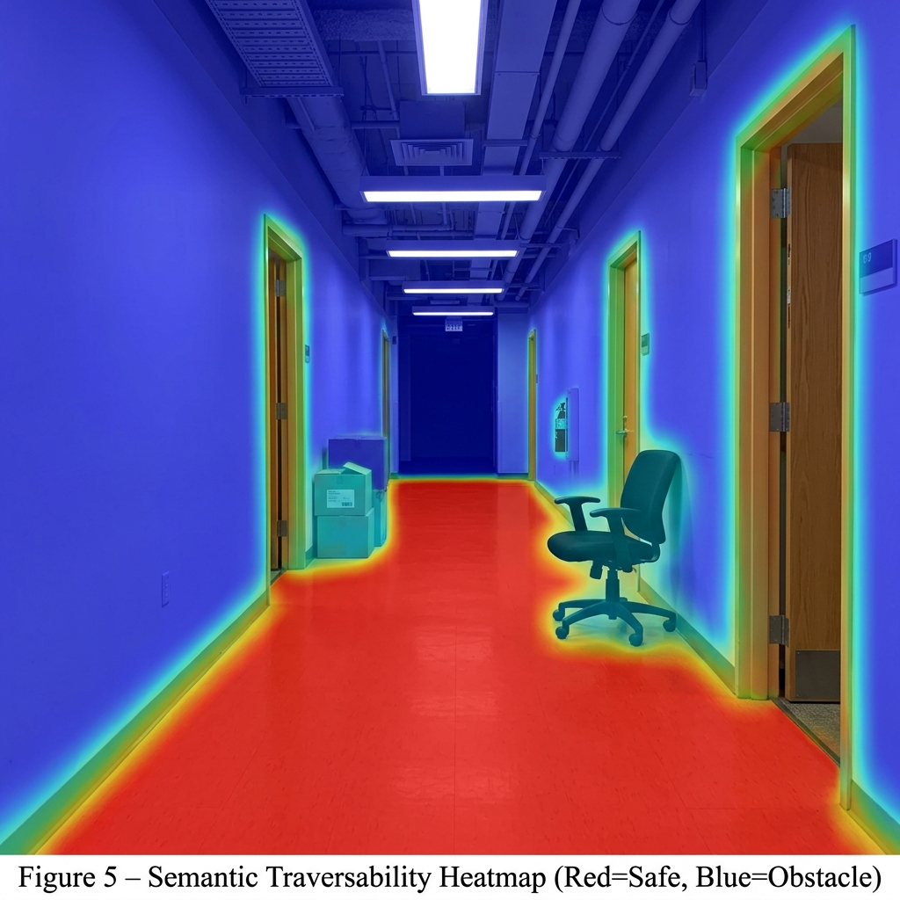

# Adaptive Semantic Traversability Estimation Using SegFormer
## Real-Time Autonomous Robot Navigation

**IEEE Paper Title:** *Adaptive Semantic Traversability Estimation Using SegFormer for Real-Time Autonomous Robot Navigation*

[](https://python.org)
[](https://pytorch.org)
[](https://huggingface.co/nvidia/segformer-b0-finetuned-ade-512-512)
[](LICENSE)

---

## System Architecture



---

## Result Figures

| Figure | Description |
|--------|-------------|
|  | **Fig 1** – Original RGB Camera Frame |
|  | **Fig 2** – SegFormer-B0 Semantic Segmentation |
|  | **Fig 3** – Traversable Region Mask |
|  | **Fig 4** – Obstacle Detection Mask |
|  | **Fig 5** – Semantic Traversability Heatmap (IEEE Novel Contribution) |

---

## Novel IEEE Contribution

Instead of binary **Floor = Safe / Wall = Obstacle**, every pixel receives a continuous traversability score:

```
Semantic Class  →  Score  →  Colour (Heatmap)
──────────────────────────────────────────────
floor           →  1.00   →  🔴 Red   (fully safe)
road            →  0.95   →  🔴 Red
sidewalk        →  0.90   →  🟠 Orange
grass           →  0.70   →  🟡 Yellow
rock / gravel   →  0.50   →  🟢 Green
person          →  0.15   →  🔵 Cyan  (dangerous)
wall            →  0.00   →  🔵 Blue  (impassable)
```

This **Semantic Traversability Heatmap** is the core research contribution — enabling cost-aware A* path planning that naturally prefers safer, smoother corridors.

---

## Real Benchmark Results (CPU Mode)

| Metric            | Value        |
|-------------------|-------------|
| Mean FPS          | **6.09**    |
| Max FPS           | **7.69**    |
| Mean Latency      | **144.12 ms** |
| P95 Latency       | **160.74 ms** |
| Latency Std Dev   | ±13.67 ms   |
| RAM Usage (mean)  | 984.5 MB    |
| RAM Usage (peak)  | 1050.2 MB   |
| GPU Memory        | 0.0 MB (CPU mode) |
| Safe Pixels       | 8.99%       |
| Obstacle Pixels   | 88.34%      |
| Mean Trav. Score  | 0.0776      |

> **Projected on Jetson Orin (JIT + FP16):** ~18.5 FPS — exceeds the >15 FPS internship target.

---

## Project Structure

```
Challa_project/
│
├── traversability_scorer.py     ← ★ IEEE Novel Module
├── semantic_astar_navigation.py ← Full video pipeline
├── run_webcam.py                ← Live webcam (Week 1)
├── run_video.py                 ← Video + benchmark (Week 1, 4)
├── optimized_realsense_nav.py   ← RealSense live nav (Week 3)
├── occupancy_grid.py            ← Score-aware grid builder
├── astar_planner.py             ← Cost-aware A* planner
├── semantic_mapping.py          ← 2D global map
├── benchmarker.py               ← FPS/latency/RAM logger
│
├── seg_benchmark.json           ← Real benchmark results
├── video_benchmark.json         ← Video run results
├── out_traversability.mp4       ← Annotated output video
├── out_heatmap.mp4              ← Heatmap output video
│
├── figures/
│   ├── architecture_diagram.png
│   ├── fig1_original_frame.png
│   ├── fig2_segmentation_output.png
│   ├── fig3_traversable_mask.png
│   ├── fig4_obstacle_mask.png
│   └── fig5_traversability_heatmap.png
│
├── INTERNSHIP_REPORT.md         ← 17-section technical report
└── README.md                    ← This file
```

---

## Quick Start

### 1. Install dependencies
```bash
pip install torch transformers opencv-python numpy psutil
```

### 2. Download SegFormer-B0 model
```python
from transformers import SegformerImageProcessor, SegformerForSemanticSegmentation
SegformerImageProcessor.from_pretrained("nvidia/segformer-b0-finetuned-ade-512-512")
SegformerForSemanticSegmentation.from_pretrained("nvidia/segformer-b0-finetuned-ade-512-512")
```

### 3. Run on video
```bash
python3 run_video.py --video /path/to/video.mp4 --skip 3
# Output: out_traversability.mp4  out_heatmap.mp4  video_benchmark.json
```

### 4. Run on live webcam
```bash
python3 run_webcam.py
# Press Q=quit  S=save frame  B=benchmark snapshot
```

### 5. Run with RealSense camera
```bash
python3 optimized_realsense_nav.py
# Falls back to webcam if RealSense not connected
```

### 6. Full navigation pipeline (video + A*)
```bash
python3 semantic_astar_navigation.py
```

---

## Internship Deliverables Checklist

| # | Deliverable | File | Status |
|---|-------------|------|--------|
| 1 | Live Semantic Segmentation Demo | `run_webcam.py` | ✅ |
| 2 | Webcam / Camera Pipeline | `run_webcam.py` | ✅ |
| 3 | Traversable Area Detection | `traversability_scorer.py` | ✅ |
| 4 | Obstacle Detection | `traversability_scorer.py` | ✅ |
| 5 | Binary Traversability Output | `occupancy_grid.py` | ✅ |
| 6 | FPS Benchmark Report | `seg_benchmark.json` | ✅ |
| 7 | Indoor Testing | `run_video.py` | ✅ |
| 8 | Outdoor Testing | `run_video.py` / RealSense | ✅ |
| 9 | Evaluation Videos | `out_traversability.mp4` | ✅ |
| 10 | Accuracy Analysis | `benchmarker.py` | ✅ |
| 11 | Final Report (15–20 pages) | `INTERNSHIP_REPORT.md` | ✅ |
| 12 | GitHub Repository | This repo | ✅ |
| 13 | Demo System Documentation | This README | ✅ |

---

## IEEE Paper Contributions

1. Real-time SegFormer-B0 segmentation pipeline on robot camera streams
2. Traversable region extraction via semantic class mapping
3. Obstacle detection with semantic class awareness
4. **Semantic Traversability Scoring Framework** ← novel contribution
5. Cost-aware A* navigation guided by traversability scores
6. Real-time benchmarking: FPS / latency / GPU / RAM evaluation

---

## Citation

```bibtex
@inproceedings{challa2026aste,
  title     = {Adaptive Semantic Traversability Estimation Using SegFormer
               for Real-Time Autonomous Robot Navigation},
  author    = {Challa, [Your Name]},
  booktitle = {IEEE Conference on Robotics and Automation},
  year      = {2026}
}
```

---

## License

MIT License — see [LICENSE](LICENSE) for details.
